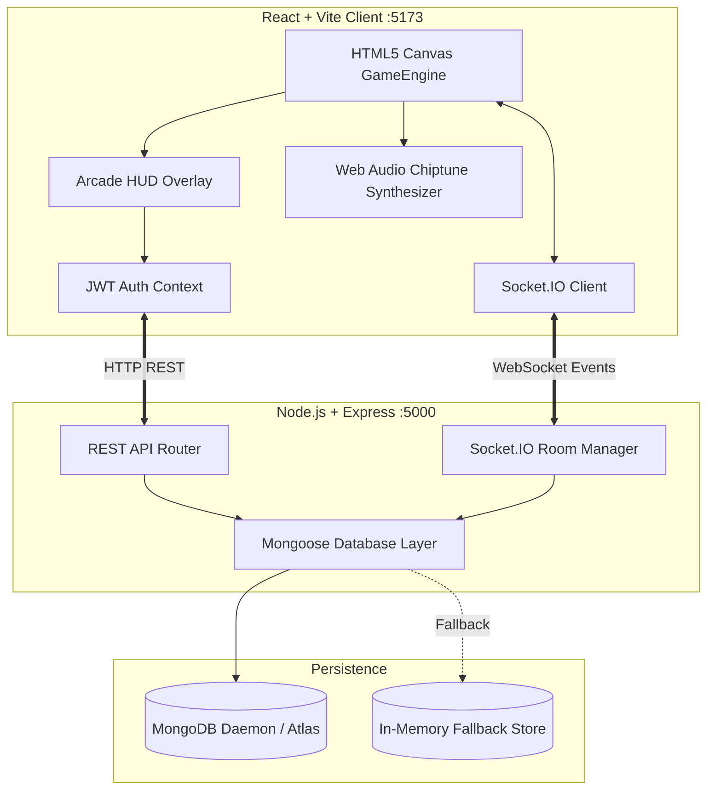

# Super Mario Survival 2D Platformer (Full-Stack MERN)

A feature-complete, retro-inspired 2D side-scrolling survival platformer game built on the **MERN** stack (MongoDB, Express, React, Node.js) with real-time **Socket.IO** multiplayer networking and procedural **Web Audio API** chiptune sound synthesis.

---

## 🎮 Key Features

- **Classic Platformer Movement & Physics**:
  - Crisp AABB physics: horizontal acceleration, variable height jumping, double-jump capability, wall sliding, and sprint boost.
  - Interactive block mechanics: Question blocks bounce and dispense power-ups; brick blocks can be shattered.
  - Pipe obstacles, spike hazards, moving platforms, and bottomless death pits.
- **Survival Resource Elements**:
  - **Health (Hearts)**: Damaged by enemy contact and spikes.
  - **Hunger & Stamina**: Depletes continuously over time, accelerating during sprint and double-jumps. If energy reaches 0%, starvation sets in and drains health.
  - **Scavenging**: Collect **Energy Bars** to restore stamina and **Super Mushrooms** to heal hearts.
  - **Time Constraint**: Stage timer adds tension and urgency.
- **Combat & Power-Ups**:
  - Stomp on Goombas and Koopas from above.
  - Collect **Fire Flowers** to transform into Fire Mario and shoot bouncing fireballs ('X' key).
- **Audio & Visual Immersion**:
  - Procedural pixel-art sprites rendered to offscreen canvases with zero external asset dependencies or 404 risks.
  - Web Audio API synthesizer generates authentic 8-bit sound effects (jump, double-jump, coin, power-up, stomp, fireball, hurt, game over, victory) and background chiptune music.
  - Multi-layer parallax backgrounds with drifting clouds and rolling green hills.
  - Glowing arcade HUD, floating score numbers, dust clouds, and spark particles.
- **Dual-Mode Multiplayer & Offline Fallback**:
  - Seamless offline single-player mode.
  - Real-time Socket.IO multiplayer rooms: join public squads or create custom rooms to play co-op with friends.
- **Full-Stack Persistence**:
  - Express REST API with JWT authentication (Register, Login, Me).
  - Player survival progress and level completion tracking.
  - Global and level-specific Leaderboards with automated speedrun and score submission.
  - Automatic in-memory database fallback if local MongoDB is not running.

---

## 🏛️ Architecture Overview



---

## 🕹️ Controls Guide

| Action | Keyboard | Touch / Mobile |
| :--- | :--- | :--- |
| **Move Left / Right** | `A` / `D` or `←` / `→` | Virtual D-Pad Left / Right |
| **Jump** | `Space` / `W` / `↑` | **A** Button |
| **Double Jump** | Tap Jump again mid-air | Tap **A** Button mid-air |
| **Sprint Boost** | `Shift` (Hold) | **Run / Lightning** Button |
| **Shoot Fireball** | `X` / `J` / `F` (When powered) | **B / Flame** Button |
| **Pause Game** | `Escape` / `P` | Pause Icon |

---

## 🚀 Quick Start & Local Setup

### Prerequisites
- [Node.js](https://nodejs.org/) v18+ (Node v20+ recommended)
- Optional: MongoDB local daemon or MongoDB Atlas connection string (an in-memory store automatically activates if MongoDB is absent)

### Installation
```bash
# 1. Install root, backend, and frontend packages
npm run install:all
```

### Running in Development
```bash
# Option A: Run both Client and Server concurrently
npm run dev:all

# Option B: Run separately
# Terminal 1 (Backend on port 5000):
npm run server

# Terminal 2 (Frontend on port 5173):
npm run client
```
Open **http://localhost:5173** in your browser to play!

---

## 🐳 Docker Deployment

To launch the full stack (MongoDB + Express/Socket.IO Server + React Nginx Client) with a single command:

```bash
docker-compose up --build
```
Access the client at **http://localhost:80** and the backend API at **http://localhost:5000**.

---

## 📡 REST API Endpoints

| Endpoint | Method | Description | Auth Required |
| :--- | :--- | :--- | :--- |
| `/api/health` | `GET` | Health check & database connection status | No |
| `/api/auth/register` | `POST` | Register a new user (`username`, `password`, `email`) | No |
| `/api/auth/login` | `POST` | Log in and receive JWT token | No |
| `/api/auth/me` | `GET` | Retrieve authenticated user profile | Yes (`Bearer <token>`) |
| `/api/progress/:userId` | `GET` | Get player survival stats, completed levels, and score | Yes |
| `/api/progress/:userId` | `POST` | Save/update player survival stats and progress | Yes |
| `/api/leaderboard` | `GET` | Retrieve top 10 rankings (optional `?levelId=1`) | No |
| `/api/leaderboard` | `POST` | Submit completed run score & time elapsed | No / Optional |
| `/api/levels` | `GET` | Retrieve level metadata, par times, and hazards | No |
| `/api/levels/:id` | `GET` | Retrieve details for specific level | No |

---

## 📊 Technical Comparisons

### Rendering Engine
| Option | Performance | Complexity | Suitability |
| :--- | :--- | :--- | :--- |
| **Canvas 2D (Used)** | 60 FPS, optimized batching | Moderate (Full control) | **Optimal**: Zero external asset 404s, lightweight |
| **WebGL / PixiJS** | High sprite count | Moderate-High | Great for particle floods, but heavier bundle |
| **Phaser 3** | High | Low-Moderate | Opinionated engine, larger footprint |

### Physics System
| Option | Precision | Platformer Feel | Evaluation |
| :--- | :--- | :--- | :--- |
| **Custom AABB (Used)** | Pixel-exact | Authentic NES/SNES jump curve | **Optimal**: Snappy, responsive, no floatiness |
| **Matter.js** | Rigid body physics | Can feel sluggish for platformers | Unnecessary complexity for grid platformers |
| **planck.js (Box2D)** | Complex joints | Heavyweight | Overkill for side-scrollers |

### Real-Time Networking
| Protocol | Latency | Browser Support | Evaluation |
| :--- | :--- | :--- | :--- |
| **Socket.IO (Used)** | ~15-35ms | 100% (WebSocket + HTTP fallback) | **Optimal**: Rooms, lobbies, reconnects built-in |
| **WebRTC DataChannels** | ~10-25ms | Modern browsers | High complexity with signaling & NAT traversal |
